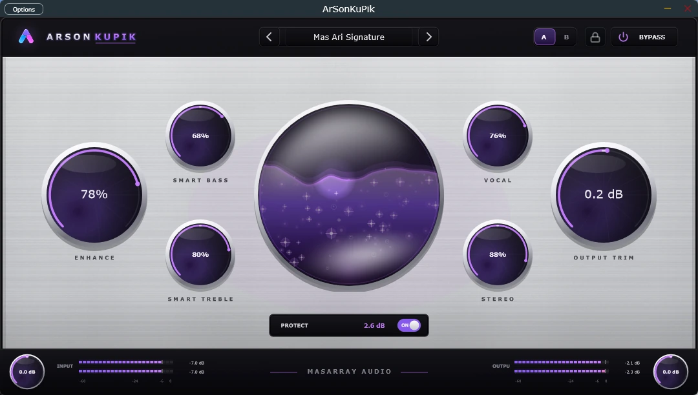

# ArSonKuPik VST — Official Public Product and Distribution Repository

[](https://masarray.github.io/vst-enhancer/)
[](https://github.com/masarray/vst-enhancer/releases/latest)
[](#compatibility)
[](#compatibility)
[](#free-365-day-evaluation--evaluasi-gratis-365-hari)
[](EULA.txt)

**English:** ArSonKuPik is a focused Windows VST3 and standalone audio enhancer for musicians, creators, producers, audio engineers, and first-time users. Every preset and control is available free for 365 days with no account, payment card, subscription, automatic charge, or obligation to buy.

**Bahasa Indonesia:** ArSonKuPik adalah audio enhancer Windows VST3 dan standalone untuk musisi, kreator, produser, audio engineer, dan pengguna awam. Seluruh preset dan kontrol tersedia gratis selama 365 hari tanpa akun, kartu pembayaran, langganan, tagihan otomatis, atau kewajiban membeli.

<p align="center">
  <a href="https://masarray.github.io/vst-enhancer/">
    
  </a>
</p>

## Official links / Tautan resmi

- **[Free product evaluation / Evaluasi produk gratis](https://masarray.github.io/vst-enhancer/)**
- **[Latest supported release / Rilis terbaru](https://github.com/masarray/vst-enhancer/releases/latest)**
- **[Optional activation information / Informasi aktivasi opsional](https://masarray.github.io/vst-enhancer/activation/)**
- **[Report a reproducible public bug / Laporkan bug publik](https://github.com/masarray/vst-enhancer/issues/new/choose)**
- **[Private security reporting / Pelaporan keamanan privat](SECURITY.md)**
- **[Support guide / Panduan dukungan](SUPPORT.md)**
- **[Public changelog / Catatan perubahan](CHANGELOG.md)**

> **Distribution safety / Keamanan distribusi:** Download only from the official website or this repository's GitHub Releases. Avoid mirrors and re-uploaded packages. Verify `SHA256SUMS.txt` from the same release before running a file.
>
> Unduh hanya melalui website resmi atau GitHub Releases repository ini. Hindari mirror dan paket yang diunggah ulang. Verifikasi `SHA256SUMS.txt` dari rilis yang sama sebelum menjalankan file.

## Current public release

Current metadata points to **v0.5.12**:

- Windows x64 installer
- VST3 ZIP package
- Standalone ZIP package
- SHA-256 checksum list
- JUCE 8.0.14 reviewed dependency baseline

Use the [latest release page](https://github.com/masarray/vst-enhancer/releases/latest) as the source of truth. The landing page reads `site/release.json` and enables direct download buttons only when public distribution is explicitly enabled.

## Public landing experience

The bilingual landing page is designed for several reading levels without splitting the product into separate marketing pages:

- **First-time users:** plain-language VST3 and Standalone explanations, preset-first guidance, and a four-step installation path.
- **Musicians and creators:** vocal, instrument, acoustic, stereo, podcast, and creative starting points.
- **Producers:** mastering and mix-bus workflows, fast A/B comparison, body, glue, depth, focus, and air.
- **Audio engineers:** track/bus/master placement, matched-gain comparison, stereo and low-end translation, and final peak/loudness verification reminders.

The page also provides a three-minute evaluation method, practical “listen for” guidance for every control, compatibility requirements, privacy information, 15 bilingual FAQs, and a separated optional-activation path.

## Free 365-day evaluation / Evaluasi gratis 365 hari

| English | Bahasa Indonesia |
|---|---|
| Every preset and editing control is available for 365 days from first launch on each computer. | Seluruh preset dan kontrol editing tersedia selama 365 hari sejak pertama kali dijalankan pada tiap komputer. |
| No account, payment card, subscription, automatic renewal, automatic charge, or audio watermark is required to begin. | Tidak memerlukan akun, kartu pembayaran, langganan, perpanjangan otomatis, tagihan otomatis, atau watermark audio untuk memulai. |
| Personal and commercial audio-production use is permitted during evaluation, subject to the EULA. | Penggunaan produksi audio personal dan komersial diizinkan selama evaluasi, tunduk pada EULA. |
| No purchase obligation exists when the evaluation ends. | Tidak ada kewajiban membeli ketika masa evaluasi berakhir. |
| After evaluation, existing projects and saved processing are designed to continue in project-safe read-only mode. | Setelah evaluasi, project lama dan pemrosesan tersimpan dirancang tetap berjalan dalam mode project-safe read-only. |

The free evaluation is intentionally separated from payment information. The main landing page helps users understand the product, choose the right format, download, install, test familiar audio, compare at matched loudness, and decide by listening.

Evaluasi gratis sengaja dipisahkan dari informasi pembayaran. Landing page utama membantu pengguna memahami produk, memilih format yang tepat, mengunduh, menginstal, mencoba audio yang familiar, membandingkan pada loudness yang seimbang, dan memutuskan berdasarkan hasil yang didengar.

## Optional activation / Aktivasi opsional

There is no obligation to buy. Users who later decide that ArSonKuPik has earned a lasting place in their workflow may review the separate [Optional Activation page](https://masarray.github.io/vst-enhancer/activation/).

The published standard plan for the v0.5 evaluation cohort is a **USD 25 one-time perpetual editing activation**, before applicable tax, with no subscription or automatic renewal. Paid checkout is not currently enabled.

An activation purchase provides concrete licence rights; it is not a donation. Revenue may help sustain independent development, JUCE licensing when applicable, testing, documentation, user support, and trusted Windows code signing and distribution. This is not a promise that each payment is earmarked for a specific vendor, certificate, or expense.

Tidak ada kewajiban membeli. Pengguna yang kemudian merasa ArSonKuPik layak menjadi bagian tetap dari workflow mereka dapat membaca [halaman Aktivasi Opsional](https://masarray.github.io/vst-enhancer/activation/).

Rencana standar yang dipublikasikan untuk pengguna evaluasi v0.5 adalah **aktivasi editing perpetual satu kali sebesar USD 25**, sebelum pajak yang berlaku, tanpa langganan atau perpanjangan otomatis. Checkout berbayar saat ini belum diaktifkan.

Pembelian aktivasi memberikan hak lisensi yang nyata; pembayaran tersebut bukan donasi. Pendapatan dapat membantu pengembangan independen, lisensi JUCE bila berlaku, testing, dokumentasi, dukungan pengguna, serta trusted Windows code signing dan distribusi. Ini bukan janji bahwa setiap pembayaran dialokasikan kepada vendor, sertifikat, atau biaya tertentu.

## Compatibility

- Windows 10/11, 64-bit
- VST3 plug-in for use inside a compatible DAW
- Standalone application for supported audio-device workflows
- macOS, Linux, VST2, AAX, and Audio Unit are not currently distributed
- Compatibility varies by DAW, driver, audio interface, sample rate, buffer, device, and security policy
- Evaluate in your own workflow before critical delivery or broadcast

## Install and verify / Instalasi dan verifikasi

1. Open the [latest official release](https://github.com/masarray/vst-enhancer/releases/latest).
2. Choose the installer, VST3 ZIP, or Standalone ZIP. Most users should choose the installer.
3. Download `SHA256SUMS.txt` from the same release.
4. Verify the exact installer name:

```powershell
Get-FileHash .\ArSonKuPik-v0.5.12-Windows-x64-Setup.exe -Algorithm SHA256
```

5. Compare the result with `SHA256SUMS.txt`. Do not continue if the values differ.
6. Keep normal Windows security and antivirus protection enabled.
7. In a DAW, open the plug-in manager and rescan VST3 plug-ins if required.

### Unsigned Windows package

The current package is distributed without a commercial Windows code-signing certificate. Windows SmartScreen may therefore show an unknown-publisher or reputation warning. The landing page keeps this disclosure in the installation and verification section so it appears at the correct decision point rather than interrupting the product introduction.

A matching SHA-256 value verifies file identity against the value published in the same release. It does not replace antivirus scanning, endpoint protection, backups, or compatibility testing.

## Privacy summary / Ringkasan privasi

ArSonKuPik processes audio locally and does not intentionally transmit audio, DAW projects, presets, parameter values, licence codes, crash analytics, advertising identifiers, or usage analytics during normal operation.

- The application checks for updates only when the user requests it.
- The website stores only the selected EN/ID language value in browser local storage.
- Offline activation uses a locally generated Computer Request ID shared only when the user chooses to request activation.
- The evaluation download has no checkout and does not collect payment-card data.
- Public GitHub Issues must not contain activation codes, Computer Request IDs, customer audio, private projects, order documents, or personal data.

See [PRIVACY.txt](PRIVACY.txt).

## Legal and policy documents

- [End User Licence Agreement](EULA.txt)
- [Commercial Activation Terms](PURCHASE_TERMS.txt)
- [Privacy Notice](PRIVACY.txt)
- [Security Policy](SECURITY.md)
- [Support Guide](SUPPORT.md)
- [Third-Party Notices](THIRD_PARTY_NOTICES.txt)
- [Public Repository Notice](LICENSE.txt)
- [Original ArSonKuPik MIT Notice](ArSonKuPik-MIT.txt)
- [Steinberg VST3 SDK MIT Notice](Steinberg-VST3-SDK-MIT.txt)
- [Plus Jakarta Sans OFL 1.1](Plus-Jakarta-Sans-OFL-1.1.txt)

The website and README provide plain-language explanations. The controlling EULA, applicable purchase and checkout terms, receipt terms, third-party notices, and mandatory applicable law govern actual use and completed transactions.

## Repository scope

This repository is public for product information, website source, release metadata, checksums, supported downloads, feedback, and public legal notices.

The proprietary DSP implementation, preset recipes, application source, private signing material, Key Activator, and customer activation records are not included.

The separately published MIT-licensed ArSonKuPik project remains governed by its original MIT terms. Its publication does not make this proprietary VST product open source.

## Local and self-hosted validation

Validation does not require GitHub-hosted runner minutes.

Run locally on Windows:

```powershell
.\tools\validate-public-release.ps1
```

Optionally validate the public release URLs from a connected machine:

```powershell
.\tools\validate-public-release.ps1 --check-remote
```

The PowerShell wrapper runs repository/release, trial-first funnel, and public-audience readability validators. The manual GitHub workflow uses a self-hosted runner and `workflow_dispatch` only. It intentionally does not execute untrusted pull-request code on the local runner.

## Safe feedback

Include the ArSonKuPik version, package type, DAW and version, Windows version, audio interface and driver, sample rate, buffer size, preset, checksum, expected behaviour, actual behaviour, and exact reproduction steps.

Never publish activation codes, Computer Request IDs, customer audio, private projects, personal data, order records, or security exploit details. Use [SECURITY.md](SECURITY.md) for private vulnerability reporting.

Copyright (C) 2026 Tutorial Mas Ari / MasArray. All rights reserved. ArSonKuPik VST is proprietary software licensed under `EULA.txt`; third-party components remain governed by their own licence terms.
