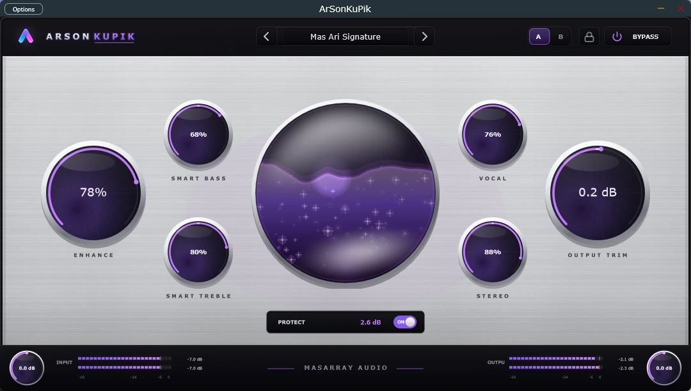

# ArSonKuPik VST3 Audio Enhancer for Windows and macOS

[](https://masarray.github.io/vst-enhancer/)
[](https://github.com/masarray/vst-enhancer/releases/latest)
[](#compatibility)
[](#downloads)
[](EULA.txt)

**ArSonKuPik** is a musical VST3 audio enhancer and standalone audio processor for Windows and macOS. It helps musicians, creators, producers and audio engineers achieve fuller body, clearer presence, deeper stereo dimension and polished detail without building a long plug-in chain.

**ArSonKuPik** adalah audio enhancer VST3 dan aplikasi standalone untuk Windows serta macOS. Produk ini membantu musisi, kreator, produser, dan audio engineer menghasilkan body yang lebih berisi, presence yang lebih jelas, dimensi stereo yang lebih dalam, serta detail yang polished tanpa membangun rangkaian plug-in yang panjang.

<p align="center">
  <a href="https://masarray.github.io/vst-enhancer/">
    
  </a>
</p>

## Overview

ArSonKuPik is designed around one principle: **shape the musical result, not the complexity**.

Every factory starting point uses the same **Mas Ari Signature Engine**. Presets do not replace the DSP topology; they provide carefully tuned starting positions over one consistent sonic foundation.

### Six focused controls

- **Enhance** — overall musical enhancement amount
- **Smart Bass** — controlled low-end weight and body
- **Smart Treble** — clarity, openness and polished air
- **Vocal** — lead presence and intelligibility
- **Stereo** — width and depth around a grounded centre
- **Smart Protect** — output protection for safer level management

### Professional starting points

The current public product includes **13 curated factory starting points** plus user preset management through `.askpreset` files.

| Category | Starting points |
|---|---:|
| Signature | 1 |
| Mastering | 3 |
| Problem solving | 3 |
| Mix bus | 1 |
| Tracks | 5 |

Factory presets include Signature Balanced, Transparent Polish, Open & Detailed, Warm Glue, Dense Mix Clarity, Dark Mix Lift, Bright Mix Safe, Punch & Separation, Vocal Forward & Silky, Guitar Definition & Body, Bass Authority, Drums Punch & Skin, and Acoustic Natural Air.

## Current public release

The reviewed public manifest records **v0.5.20** for Windows x64 and macOS Universal. The product website resolves the latest supported GitHub Release and routes downloads only to official assets from this repository.

- [Open the product website](https://masarray.github.io/vst-enhancer/)
- [Download the latest supported release](https://github.com/masarray/vst-enhancer/releases/latest)
- [Read the public changelog](CHANGELOG.md)
- [Review release provenance](RELEASE-PROVENANCE.md)

## Downloads

### Windows

- Windows 10/11 x64 installer
- Manual VST3 ZIP
- Standalone ZIP
- Packages are not commercially code-signed and may trigger SmartScreen

### macOS

- macOS 11 or later
- Universal Apple Silicon `arm64` and Intel `x86_64`
- VST3 ZIP, Standalone ZIP and DMG
- Ad-hoc signed only; not Developer ID signed and not notarized
- Gatekeeper may require Control-click → **Open** or **Open Anyway**

### Verify every download

Download `SHA256SUMS.txt` from the same release and verify the exact filename before installation.

Windows PowerShell:

```powershell
Get-FileHash .\<downloaded-file-name> -Algorithm SHA256
```

macOS Terminal:

```bash
shasum -a 256 <downloaded-file-name>
```

Do not continue when the calculated value differs from the official checksum. A matching SHA-256 confirms file identity against the published hash; it does not replace antivirus, endpoint protection, Gatekeeper, backups or compatibility testing.

## Sound and A/B comparison

**Gain Match defaults to OFF.** Normal listening keeps the intended safe creative lift audible. Enable Gain Match only when you want an explicit level-equal comparison of tonal character. Independent `-1 dBFS` peak safety remains active in both modes.

## Evaluation and optional activation

Every preset and editing control is available for **365 days from first launch on each computer**.

- No account required
- No payment card required
- No subscription
- No automatic renewal
- No automatic charge
- No obligation to buy

After full editing ends, existing projects, saved values, meters, automation playback and audio processing are designed to continue in project-safe read-only mode. Optional activation is relevant only for continued editing, subject to the EULA and technical compatibility.

Optional perpetual activation for one active computer is **Rp399.000**. A purchase provides concrete licence rights; it is not a donation.

## Compatibility

| Area | Supported public configuration |
|---|---|
| Windows | Windows 10/11, 64-bit |
| macOS | macOS 11 or later, Universal `arm64` + `x86_64` |
| Plug-in format | VST3 in a compatible host or DAW |
| Standalone | Supported audio-device workflows |
| Not currently distributed | Linux, VST2, AAX and Audio Unit |

Compatibility varies by DAW, host, driver, audio interface, sample rate, buffer size, device and security policy. Evaluate the current release in the actual target workflow before critical delivery, recording, streaming or broadcast.

## Privacy and security

ArSonKuPik processes audio locally and does not intentionally transmit audio, DAW projects, presets, parameter values, licence codes, crash analytics, advertising identifiers or usage analytics during normal operation.

- The application may make a bounded latest-release metadata check after an initial delay.
- The website stores only the selected EN/ID language value in browser local storage.
- Public GitHub Issues must not contain activation codes, Computer Request IDs, customer audio, private projects, order documents or personal data.

Read the complete [Privacy Notice](PRIVACY.txt) and [Security Policy](SECURITY.md).

## Repository scope

This public repository contains:

- bilingual product website source;
- public release metadata and checksums;
- supported download and release information;
- public legal, privacy, support and security notices;
- validation tools for the public distribution surface; and
- issue and contribution workflows.

This repository does **not** contain the proprietary DSP implementation, preset recipes, application source, private signing material, Key Activator or customer activation records.

The separately published MIT-licensed ArSonKuPik project remains governed by its original MIT terms. Its publication does not make this proprietary VST product open source.

## Local validation

Run the reviewed validation entry point on Windows:

```powershell
.\tools\validate-public-release.ps1
```

Optionally validate public release URLs from a connected machine:

```powershell
.\tools\validate-public-release.ps1 --check-remote
```

## Support and contributions

- Read [SUPPORT.md](SUPPORT.md) before opening a public bug report.
- Use the structured [issue forms](https://github.com/masarray/vst-enhancer/issues/new/choose) for reproducible, non-confidential problems.
- Report vulnerabilities through [GitHub private vulnerability reporting](https://github.com/masarray/vst-enhancer/security/advisories/new).
- Read [CONTRIBUTING.md](CONTRIBUTING.md) before proposing website, documentation, localization, validation or public-metadata changes.

Never publish activation codes, Computer Request IDs, customer audio, private projects, personal data, order records or security exploit details.

## Official links

- [Product website](https://masarray.github.io/vst-enhancer/)
- [Bahasa Indonesia website](https://masarray.github.io/vst-enhancer/id/)
- [Latest supported release](https://github.com/masarray/vst-enhancer/releases/latest)
- [Optional support and activation](https://masarray.github.io/vst-enhancer/activation/)
- [Public changelog](CHANGELOG.md)
- [End User Licence Agreement](EULA.txt)
- [Purchase Terms](PURCHASE_TERMS.txt)

> Download only from the official website or this repository's GitHub Releases. Avoid mirrors and re-uploaded packages, and verify `SHA256SUMS.txt` from the same release before opening any package.

Copyright (C) 2026 Tutorial Mas Ari / MasArray. All rights reserved. ArSonKuPik VST is proprietary software licensed under `EULA.txt`; third-party components remain governed by their own licence terms.
